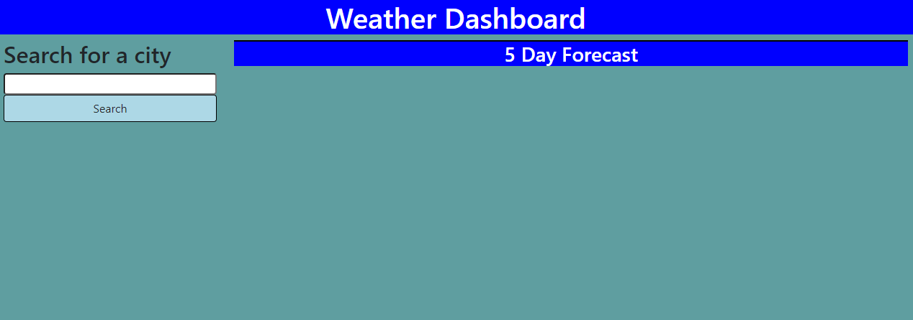

# Weather Dashboard

## Description

A weather dashboard that will show weather conditions for a searched city.  the weather conditions include current and 5 day forecast.  A search history will also be saved for easy retrieval of favorite spots.

## Languages/sources Used

- HTML
- CSS
- javascript
- bootstrap
- moment.js
- openweathermap API

## Usage

[Deployed webpage](https://josephkurpierz.github.io/weather-dashboard/)

[github Repo](https://github.com/josephkurpierz/weather-dashboard)

To use this site, type city name into search bar.  View current and 5 day forecast weather conditions for given city...if UV Index is red, ensure the use of protection.  City will be saved as a quick link under the search bar for future return reference.

## License

[MIT license](./LICENSE.txt)